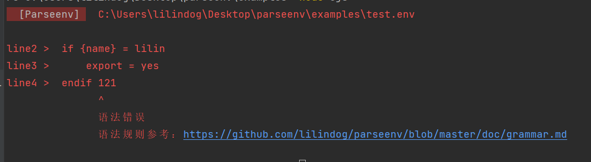

# parseenv

这是一个.env文件解析器，它兼容dotenv的语法格式。   

## 🚨 注意
条件语句解析生成的运算函数内部使用了可选链运算符，node版本需>=14。      
建议安装标签为release的版本, 如：`npm install --save-dev git+https://github.com/lilindog/parseenv#release`。        


## ⚡ 功能
除了兼容dotenv的语法外，它增加了以下语法：   
* 支持`if else elseif`条件语句。  
* 支持`include` 引入本地、远程env文件。
* 支持列表LIST、字典MAP语法。
* 支持环境变量插值。   

## ✊ 语法
除了支持dotenv的语法外，新增的语法请看[这里](./doc/grammar.md)。  
会检查语法，若语法错误会提示如下图：  



## 🔨 API
模块导出仅一个函数，参数是env文件的地址，返回解析结果或者带有结果的Promise。     
>如果传入给函数的env文件中有include远程文件则返回结果为promise。  
>否则直接返回结果。   

api简单示例：
```js
// commonjs
const parseenv = require("parseenv");
console.log(parseenv("./production.env")); // Object|Promise<Object>

// esm
import parseenv from "parseenv";
console.log(parseenv("./production.env"));   
```

## 👉 示例
* [从远程加载数据库账密配置](./doc/example1.md)
* [多同事间同步使用相同env配置](./doc/example2.md)

## 🙏 Thanks
Thanks to JetBrains OSS development license   
感谢JetBrains的开源license      

